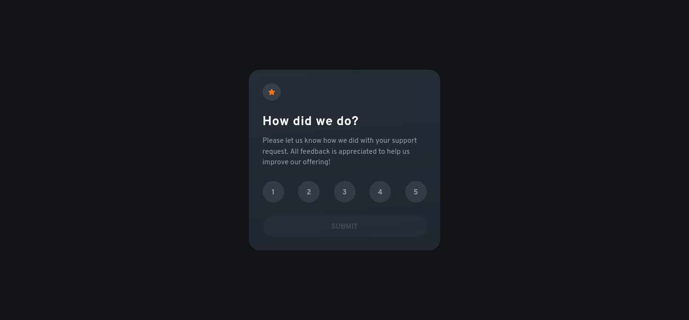
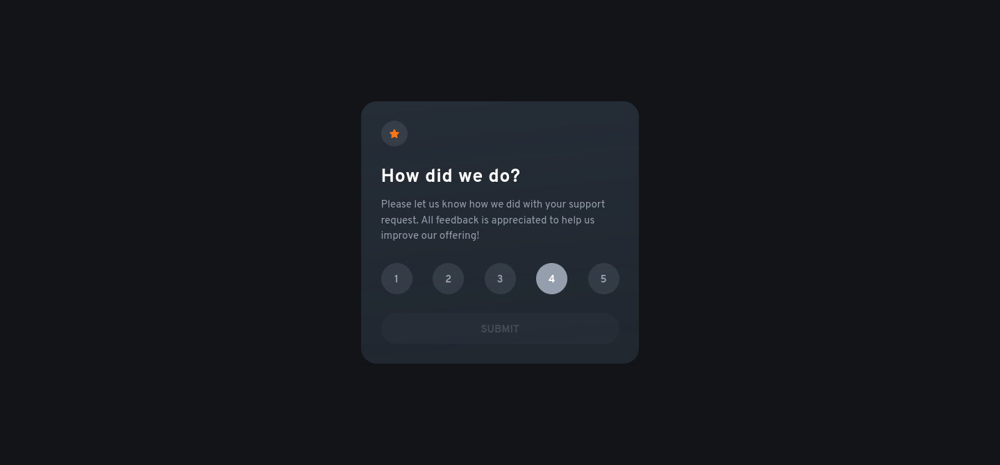
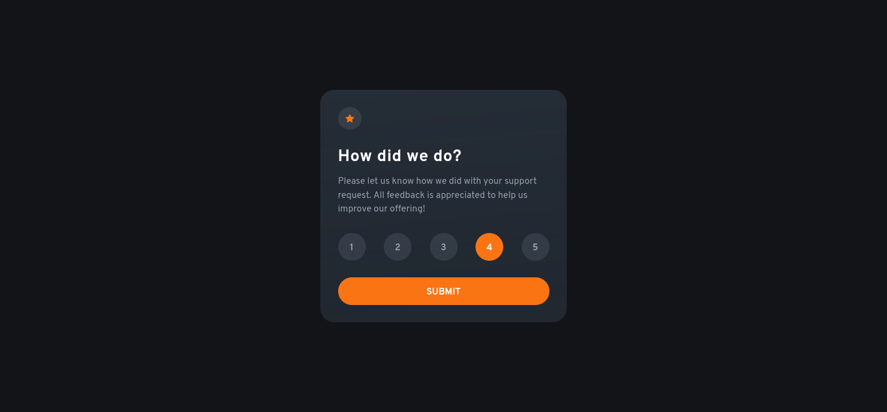
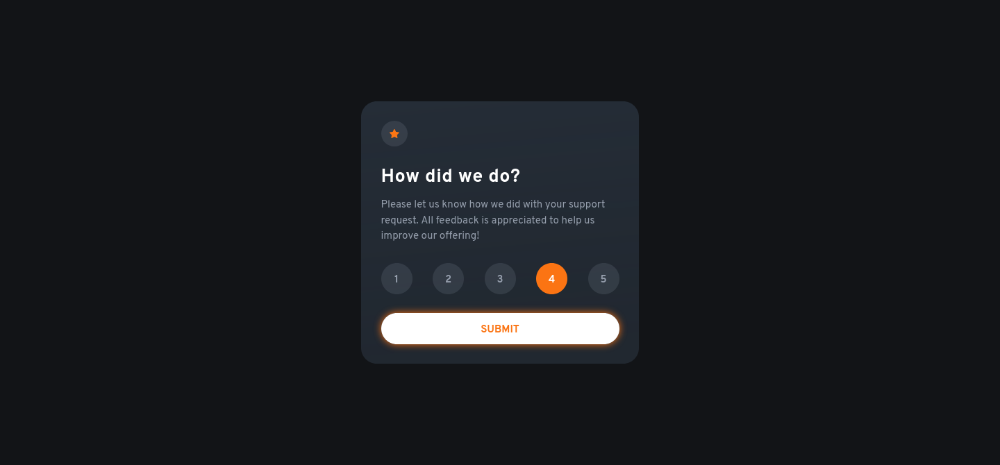

# Frontend Mentor - Interactive rating component solution

This is a solution to the [Interactive rating component challenge on Frontend Mentor](https://www.frontendmentor.io/challenges/interactive-rating-component-koxpeBUmI). Frontend Mentor challenges help you improve your coding skills by building realistic projects. 

## Table of contents

- [Frontend Mentor - Interactive rating component solution](#frontend-mentor---interactive-rating-component-solution)
  - [Table of contents](#table-of-contents)
  - [Overview](#overview)
    - [The challenge](#the-challenge)
    - [Screenshot](#screenshot)
    - [Links](#links)
  - [My process](#my-process)
    - [Built with](#built-with)
    - [What I learned](#what-i-learned)
    - [Continued development](#continued-development)
  - [Author](#author)

## Overview

### The challenge

Users should be able to:

- View the optimal layout for the app depending on their device's screen size
- See hover states for all interactive elements on the page
- Select and submit a number rating
- See the "Thank you" card state after submitting a rating

### Screenshot

Waiting for selection

Rating hover

Selected rating

Submit hover

### Links

<!-- TODO: Add Link to solution -->
<!-- - Solution URL: [Add solution URL here](https://your-solution-url.com) -->
<!-- TODO: Add link to live site URL -->
- Live Site URL: [Github Pages](https://lau-san.github.io/fm-interactive-rating-component/)

## My process

### Built with

- Semantic HTML5 markup
- Flexbox
- [Sass](https://sass-lang.com)

### What I learned

I got an idea of how to work with JavaScript.

### Continued development

Obviously, I don't know the best practices for working with JavaScript, so that's
something I should look into.

## Author

- Frontend Mentor - [@Lau-San](https://www.frontendmentor.io/profile/Lau-San)
